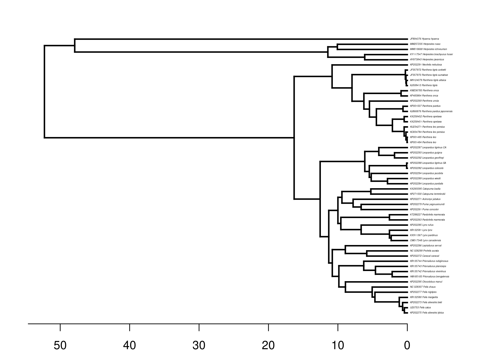
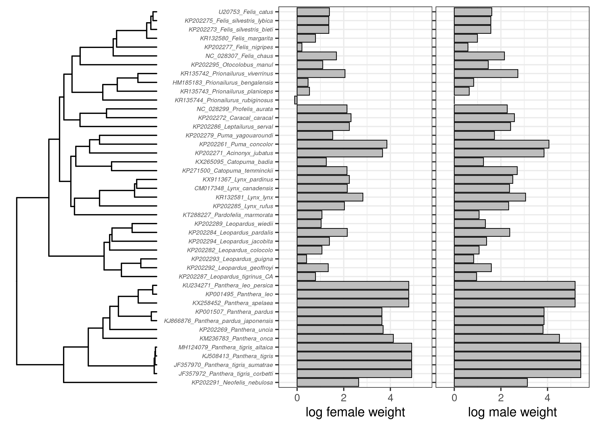
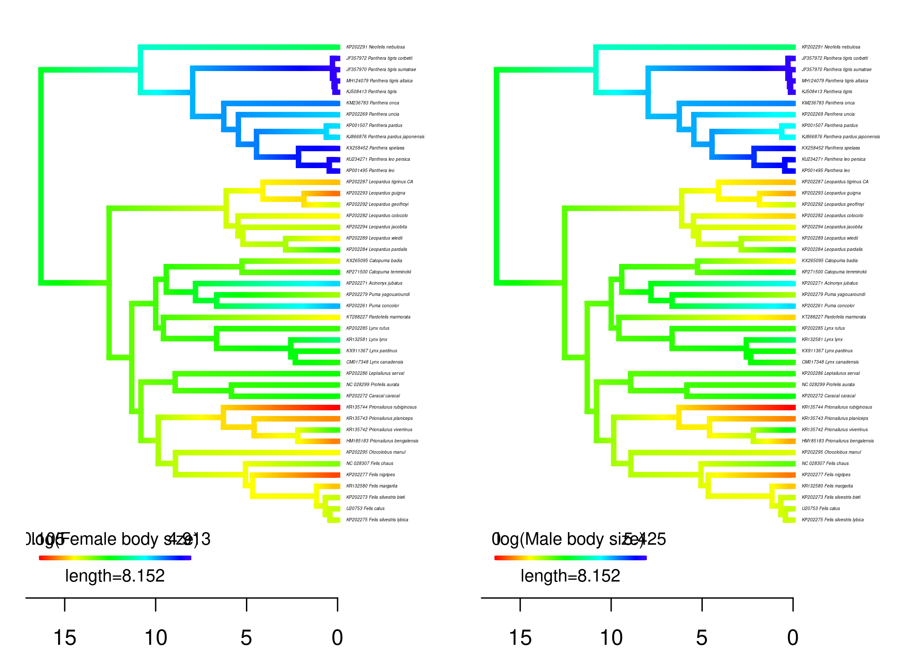
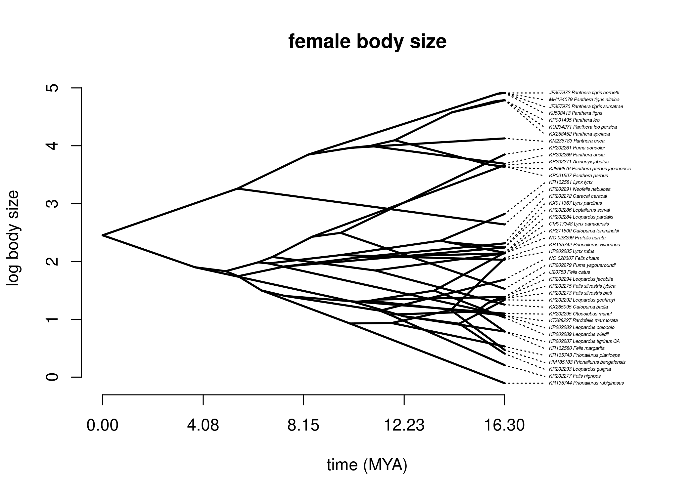
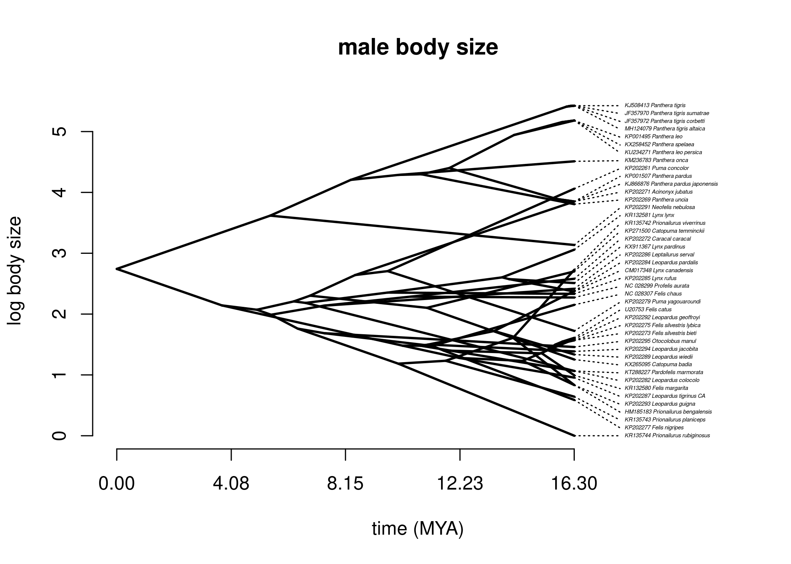
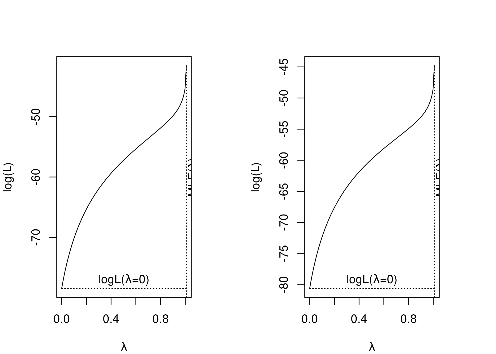
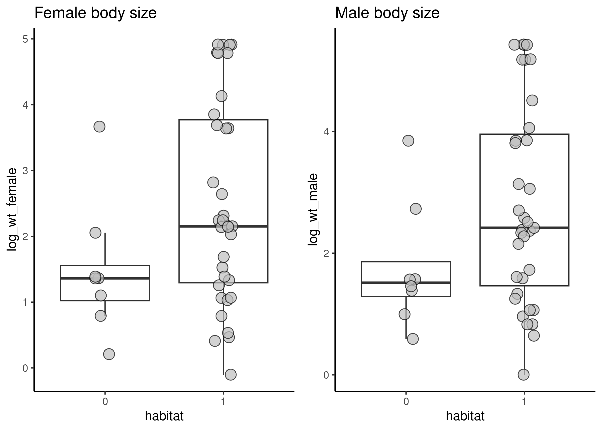

Models of continuous trait evolution
================
Sridhar Halali
2023-05-02

In this simple tutorial, we will employ some of the simple evolutionary
models for continuous traits (here body size of cats) including
measuring phylogenetic signal, ancestral state reconstruction and
testing for correlated evolution.

# Install/load required libraries and set working directory

``` r
library(ape)
library(phytools)
library(geiger)
library(tidyverse)
library(ggtree)
library(aplot)
library(gridExtra)
library(nlme)
library(openxlsx)
```

# Importing and plottting tree

``` r
felidae_phy <- read.nexus("FelidaeTimes.tre")
felidae_phy
```

    ## 
    ## Phylogenetic tree with 54 tips and 53 internal nodes.
    ## 
    ## Tip labels:
    ##   AY873843_Herpestes_javanicus, CM017348_Lynx_canadensis, HM185183_Prionailurus_bengalensis, JF357970_Panthera_tigris_sumatrae, JF357972_Panthera_tigris_corbetti, JF894376_Hyaena_hyaena, ...
    ## 
    ## Rooted; includes branch lengths.

``` r
# ladderizing the tree & adding the scale in millions of years
plotTree(ladderize(felidae_phy), fsize=0.2, ftype= 'i', mar=c(2,2,2,2))
axisPhylo()
```

<!-- -->

# Importing the data file

This data file contains information on the body size and habitat of cats

``` r
felidae_data <- read.xlsx("felidae_body_size.xlsx")
head(felidae_data, n=3)
```

    ##                            tip_name             organism_name habitat
    ## 1          CM017348_Lynx_canadensis           Lynx canadensis       1
    ## 2 HM185183_Prionailurus_bengalensis Prionailurus bengalensisa       1
    ## 3 JF357970_Panthera_tigris_sumatrae  Panthera tigris sumatrae       1
    ##   male_weight_kg female_weight_kg
    ## 1           10.7              8.6
    ## 2            2.3              1.6
    ## 3          227.0            136.0

``` r
# looking at the structure of the data
glimpse(felidae_data)
```

    ## Rows: 43
    ## Columns: 5
    ## $ tip_name         <chr> "CM017348_Lynx_canadensis", "HM185183_Prionailurus_be…
    ## $ organism_name    <chr> "Lynx canadensis", "Prionailurus bengalensisa", "Pant…
    ## $ habitat          <dbl> 1, 1, 1, 1, 1, 1, 1, 1, 1, 1, 1, 0, 1, 0, 0, 0, 1, 1,…
    ## $ male_weight_kg   <dbl> 10.7, 2.3, 227.0, 227.0, 227.0, 47.0, 91.0, 178.0, 47…
    ## $ female_weight_kg <dbl> 8.60, 1.60, 136.00, 136.00, 136.00, 38.00, 62.00, 120…

``` r
# Factorising columns if categories
felidae_data <- felidae_data %>% 
  mutate_if(is.character, as.factor) %>% 
  mutate(habitat = as.factor(habitat))

# Also, let's convert weights on (natural) log scale. I am creating another columns 'species_names' which will be useful later
felidae_data <- felidae_data %>% 
  mutate(log_wt_male = log(male_weight_kg),
         log_wt_female = log(female_weight_kg),
         species_names= tip_name) %>% 
  relocate(species_names, .before = organism_name)
```

# Matching tip labels and rownames in the dataset

Before we proceed, it is a good idea to make sure if our tree labels and
row names are matching. We’ll use the ‘name.check’ function from the
‘geiger’ package. You’ll see that there are five taxa which are in the
tree but not in the data which we need to drop before moving on with the
analyses.

``` r
# first assigning the first column rownames
felidae_data <- data.frame(felidae_data, row.names = 1)

# Using the name.check function from geiger
felidae_check <- name.check(felidae_phy, felidae_data)
felidae_check
```

    ## $tree_not_data
    ##  [1] "AY873843_Herpestes_javanicus"        "JF894376_Hyaena_hyaena"             
    ##  [3] "KC834784_Panthera_leo_persica"       "KF483864_Panthera_onca"             
    ##  [5] "KP001494_Panthera_leo"               "KP202263_Pardofelis_marmorata"      
    ##  [7] "KP202288_Leopardus_tigrinus_SA"      "KX258451_Panthera_spelaea"          
    ##  [9] "KY117547_Herpestes_brachyurus_hosei" "MW019668_Herpestes_ichneumon"       
    ## [11] "MW257235_Herpestes_naso"            
    ## 
    ## $data_not_tree
    ## character(0)

``` r
# dropping species not in the data set
felidae_tree <- drop.tip(felidae_phy, felidae_check$tree_not_data)
felidae_tree
```

    ## 
    ## Phylogenetic tree with 43 tips and 42 internal nodes.
    ## 
    ## Tip labels:
    ##   CM017348_Lynx_canadensis, HM185183_Prionailurus_bengalensis, JF357970_Panthera_tigris_sumatrae, JF357972_Panthera_tigris_corbetti, KJ508413_Panthera_tigris, KJ866876_Panthera_pardus_japonensis, ...
    ## 
    ## Rooted; includes branch lengths.

``` r
## do name check again & now tip labels and row names of the data should match
name.check(felidae_tree, felidae_data)
```

    ## [1] "OK"

``` r
# Now sorting the rownames in the same order as tip label
felidae_data <- felidae_data[felidae_tree$tip.label, ]
```

# Proceeding with comparative analyses

Now we are ready to do some comparative analyses. The first goal is to
gain some insights into the patterns of body size/mass evolution (in
both females and males). We’ll first use some methods to map our trait
of interest on to the phylogeny and then proceed with calculating
phylogenetic signal, fitting models of evolution for body size,
ancestral state reconstruction and phylogenetic regression.

## Plotting traits on the phylogeny

Let’s plot both log transformed female and male body size on the
phylogeny and see if we can see some patterns. We’ll do the plotting
using the ‘ggtree’ (works similar to the ‘ggplot2’ package if you have
used it before) and ‘aplot’ package. You can also use some functions
from phytools (see plotTree.wBars or plotTree.barplot).

``` r
# plotting phylogeny
cat_tree <- ggtree(felidae_tree)

# plotting bar graph for female log transformed body size
# first setting plotting theme

female_plot <- ggplot(felidae_data, aes(log_wt_female, species_names)) + 
  geom_col(fill= "grey", color="black", lwd=0.3) + 
  scale_x_continuous(limits= c(-0.5,5.5)) +
  xlab("log female weight") +
  theme_bw() +
  theme(axis.title.y = element_blank(), 
        axis.text.y = element_text(size=5, face="italic"))

male_plot <- ggplot(felidae_data, aes(log_wt_male, species_names)) +
  geom_col(fill= "grey", color="black", lwd=0.3) + 
  scale_x_continuous(limits= c(-0.5,5.5)) + 
  xlab("log male weight") +
  theme_bw() +
  theme(axis.text.y = element_blank(),
        axis.title.y = element_blank())
        
# using aplot
female_plot %>% insert_left(cat_tree) %>%  insert_right(male_plot)
```

<!-- -->

``` r
# One species has very low body size
felidae_data %>% filter(log_wt_female <0)
```

    ##                                                       species_names
    ## KR135744_Prionailurus_rubiginosus KR135744_Prionailurus_rubiginosus
    ##                                              organism_name habitat
    ## KR135744_Prionailurus_rubiginosus Prionailurus rubiginosus       1
    ##                                   male_weight_kg female_weight_kg log_wt_male
    ## KR135744_Prionailurus_rubiginosus              1              0.9           0
    ##                                   log_wt_female
    ## KR135744_Prionailurus_rubiginosus    -0.1053605

# Ancestral reconstruction

Let’s proceed and visualize body size through time on our tree using two
phytools functions ‘contMap’ and ‘phenogram’. contMap reconstructs
ancestral states at each node by assuming the Brownian motion model of
evolution (it is possible to use other models such Early burst or
Ornstein-Uhlenbeck model). And, phenogram
is a great way to visualize the degree of trait similarity across taxa
(again using the Brownian Motion model).

``` r
# First, we need to extract the trait of interest which is body size in this case
female_size <- setNames(felidae_data$log_wt_female, rownames(felidae_data))
head(female_size)
```

    ##            CM017348_Lynx_canadensis   HM185183_Prionailurus_bengalensis 
    ##                           2.1517622                           0.4700036 
    ##   JF357970_Panthera_tigris_sumatrae   JF357972_Panthera_tigris_corbetti 
    ##                           4.9126549                           4.9126549 
    ##            KJ508413_Panthera_tigris KJ866876_Panthera_pardus_japonensis 
    ##                           4.9126549                           3.6375862

``` r
male_size <- setNames(felidae_data$log_wt_male, rownames(felidae_data))


# Setting plotting parameters
par(mfrow=c(1,2))

# female body size
contMap(ladderize(felidae_tree), female_size, fsize= c(0.2, 0.8), lwd=c(4,3), 
     leg.txt= "log(Female body size)", outline=F, mar=c(2,1,1,1)) 
axisPhylo()

# male body size
contMap(ladderize(felidae_tree), male_size, fsize= c(0.2, 0.8), lwd=c(4,3), 
     leg.txt= "log(Male body size)", outline=F, mar=c(2,1,1,1)) 
axisPhylo()
```

<!-- -->

Plot phenograms/traitgrams for both females and male body size

``` r
phenogram(felidae_tree, female_size, ftype="i",
    spread.cost=c(1,0),fsize=0.3,xlab="time (MYA)",
    ylab="log body size", main= "female body size")
```

    ## Optimizing the positions of the tip labels...

<!-- -->

``` r
phenogram(felidae_tree, male_size, ftype="i",
    spread.cost=c(1,0),fsize=0.3,xlab="time (MYA)",
    ylab="log body size", main= "male body size")
```

    ## Optimizing the positions of the tip labels...

<!-- -->

# Measuring phylogenetic signal

Since we now have some idea on body size evolution, we will go ahead and
calculate phylogenetic signal. One of the most commonly used metric of
phylogenetic signal is Pagel’s lambda and its value generally ranges
from 0 to 1. A value of 1 means that closely related species have
similar trait values (i.e. the trait evolving via the Brownian motion
model of evolution), while the value of 0 means there is no phylogenetic
information (i.e. that a star phylogeny can explain trait
evolution).

Pagel’s lambda

``` r
# Phylogenetic signal for female body size
female_lambda <- phylosig(felidae_tree, female_size, method= "lambda", test=T)
female_lambda
```

    ## 
    ## Phylogenetic signal lambda : 1.0088 
    ## logL(lambda) : -41.5126 
    ## LR(lambda=0) : 73.9449 
    ## P-value (based on LR test) : 8.03265e-18

``` r
# Phylogenetic signal for male body size
male_lambda <- phylosig(felidae_tree, male_size, method= "lambda", test=T)
male_lambda
```

    ## 
    ## Phylogenetic signal lambda : 1.0088 
    ## logL(lambda) : -44.7849 
    ## LR(lambda=0) : 71.6065 
    ## P-value (based on LR test) : 2.62694e-17

``` r
# plotting likelihood surface
par(mfrow=c(1,2), mar=c(4,4,4,4))

plot(female_lambda)
plot(male_lambda)
```

<!-- -->

# Fitting models of trait evolution

Here, we will fit several models of trait evolution which can provide us
some insights into the tempo of trait evolution, for example, whether
the trait is evolving by means of drift (i.e Brownian motion model) or other variants 
of Brownian Motion model. Fitting these models can act as a good preliminary
step and one can use more complex models (e.g. those that can
incorporate rate heterogeniety) to test specific hypotheses. The models
we are fitting here assume the homogenous rate of evolution. We will use
fitContinuous function from geiger package to fit five (Brownian, Brownian with
trend, Early Burst, Ornstein-Uhlenbeck & white noise) trait evolution
models.

``` r
# female data

# Brownian
fitBM_female <- fitContinuous(felidae_tree, female_size, model= "BM")

# Brownian with trend
fitBMTrend_female <- fitContinuous(felidae_tree, female_size, model= "trend")

# Early Burst model
fitEB_female <- fitContinuous(felidae_tree, female_size, model= "EB")

# Ornstein-Uhlenbeck model
fitOU_female <- fitContinuous(felidae_tree, female_size, model= "OU")

# White noise model (or non phylogenetic model)
fitWhiteN_female <- fitContinuous(felidae_tree, female_size, model= "white")

## male data
fitBM_male <- fitContinuous(felidae_tree, male_size, model= "BM")
fitBMTrend_male <- fitContinuous(felidae_tree, male_size, model= "trend")
fitEB_male <- fitContinuous(felidae_tree, male_size, model= "EB")
fitOU_male <- fitContinuous(felidae_tree, male_size, model= "OU")
fitWhiteN_male <- fitContinuous(felidae_tree, male_size, model= "white")
```

## Summarise log likelihood and AICc values in a table

``` r
model_fits <- data.frame(
dataset = rep(c("female", "male"), times = c(5, 5)),
models= c("BM", "BM_trend", "EB", "OU", "White Noise"),
logLik = c(fitBM_female$opt$lnL, fitBMTrend_female$opt$lnL, fitEB_female$opt$lnL,
           fitOU_female$opt$lnL, fitWhiteN_female$opt$lnL, 
           fitBM_male$opt$lnL, fitBMTrend_male$opt$lnL, fitEB_male$opt$lnL,
           fitOU_male$opt$lnL, fitWhiteN_male$opt$lnL), 
aicc = c(fitBM_female$opt$aicc, fitBMTrend_female$opt$aicc, fitEB_female$opt$aicc,
           fitOU_female$opt$aicc, fitWhiteN_female$opt$aicc, 
           fitBM_male$opt$aicc, fitBMTrend_male$opt$aicc, fitEB_male$opt$aicc,
           fitOU_male$opt$aicc, fitWhiteN_male$opt$aicc))
model_fits
```

    ##    dataset      models    logLik      aicc
    ## 1   female          BM -45.11897  94.53795
    ## 2   female    BM_trend -44.84237  96.30013
    ## 3   female          EB -44.85430  96.32399
    ## 4   female          OU -45.11897  96.85333
    ## 5   female White Noise -78.48504 161.27008
    ## 6     male          BM -48.39228 101.08456
    ## 7     male    BM_trend -48.25258 103.12054
    ## 8     male          EB -48.25987 103.13512
    ## 9     male          OU -48.39228 103.39995
    ## 10    male White Noise -80.58813 165.47626

It seems like Brownian motion is a better fitting model (although aicc
values are not greatly different) and white noise is the worst fitting
model (not surprising!). Now have a look at the parameter estimate of
the Brownian model (sigma^2 indicates evolutionary rate per unit time and z0 is the
value of the trait at the root).

## Phylogenetic generalised least squares

Phylogenetic generalised least squares (PGLS) is a popular 
method for testing the evolutionary correlation between the response
variable (which here is body size) and (ecological) predictors (which
here is habitat). PGLS is an extension of the standard least squares
regression but can account for evolutionary relationships
between species. PGLS is quite flexible and allows fitting
different models of evolution (Brownian, OU, Pagel’s lambda) by altering
the variance-covariance matrix.

For this tutorial, the question that can be addressed is: does body size
differ between forest and open habitat species?

First, let’s explore the distribution of body mass across habitats using
simple plot

``` r
# female body sizes across habitats
female_wt_plot <-  felidae_data %>% 
  ggplot(aes(habitat, log_wt_female)) +
  geom_boxplot(outlier.shape = NA, alpha=0.2) +
  geom_jitter(shape=21, size=4, width=0.09,  alpha=0.7, fill="grey") + 
  ggtitle("Female body size") +
  theme_classic()

male_wt_plot <- felidae_data %>% 
  ggplot(aes(habitat, log_wt_male)) +
 geom_boxplot(outlier.shape = NA, alpha=0.2) +
  geom_jitter(shape=21, size=4, width=0.09, alpha=0.7, fill="grey") + 
  ggtitle("Male body size") +
  theme_classic()

# making  panel
grid.arrange(female_wt_plot, male_wt_plot, ncol=2)
```

<!-- -->

It looks like forest species are slightly larger compared to those in
open habitats but also have a large variance. But it is also important to
note here the sample size or number of species in each category. Let’s
fit PGLS models using ‘gls’ function in nlme package. We’ll fit
Brownian, Ornstein-Uhlenbeck, Pagel’s lambda model and another model
which is equivalent to non-phylogenetic or standard OLS regression. Here
I am fitting the models only on the female body size.

## Fitting PGLS models

``` r
# Setting correlation structures

# Brownian motion model
BM_model <- corBrownian(value=1, phy=felidae_tree, form=~species_names)

# Ornstein-Uhlenbeck model
OU_model <- corMartins(value=1, phy=felidae_tree, form= ~species_names)

# Pagel's lambda model
Lambda_model <- corPagel(value=1, phy=felidae_tree, form= ~species_names)

# Pagel's lambda model fixed to zero
Lambda0_model <- corPagel(value=0, fixed=T, phy=felidae_tree, form= ~species_names)


# Fitting the models

# BM pgls
felidae_BM <- gls(log_wt_female ~ habitat, correlation = BM_model, data= felidae_data, method= "ML")

# OU pgls                                 
felidae_OU <- gls(log_wt_female ~ habitat, correlation = OU_model, data= felidae_data, method= "ML")

# Lambda pgls                                 
felidae_Lambda <- gls(log_wt_female ~ habitat, correlation = Lambda_model,  data= felidae_data, method= "ML")
                     
# Lambda pgls fixed to zero                                 
felidae_Lambda_0 <- gls(log_wt_female ~ habitat, correlation = Lambda0_model,  data= felidae_data, method= "ML")
                     
# Compare AIC score for these models
AIC(felidae_BM, felidae_OU, felidae_Lambda, felidae_Lambda_0)
```

    ##                  df       AIC
    ## felidae_BM        3  95.93175
    ## felidae_OU        4 101.02230
    ## felidae_Lambda    4  71.05924
    ## felidae_Lambda_0  3 159.78000

``` r
# Seems like Pagel's lambda is the best fitting and non-phylognetic (lambda=0) is the worst-fitting model. Look at the summary of the Lambda model
summary(felidae_Lambda)
```

    ## Generalized least squares fit by maximum likelihood
    ##   Model: log_wt_female ~ habitat 
    ##   Data: felidae_data 
    ##        AIC      BIC    logLik
    ##   71.05924 78.10404 -31.52962
    ## 
    ## Correlation Structure: corPagel
    ##  Formula: ~species_names 
    ##  Parameter estimate(s):
    ##   lambda 
    ## 1.008877 
    ## 
    ## Coefficients:
    ##                  Value Std.Error   t-value p-value
    ## (Intercept)  2.5252620 0.6036494  4.183326  0.0001
    ## habitat1    -0.0859626 0.1843772 -0.466232  0.6435
    ## 
    ##  Correlation: 
    ##          (Intr)
    ## habitat1 -0.266
    ## 
    ## Standardized residuals:
    ##        Min         Q1        Med         Q3        Max 
    ## -2.0853756 -1.0494345 -0.2452248  0.9820087  2.0269409 
    ## 
    ## Residual standard error: 1.220241 
    ## Degrees of freedom: 43 total; 41 residual

``` r
# getting intervals of parameter estimates
intervals(felidae_Lambda)
```

    ## Approximate 95% confidence intervals
    ## 
    ##  Coefficients:
    ##                 lower        est.     upper
    ## (Intercept)  1.306167  2.52526199 3.7443567
    ## habitat1    -0.458320 -0.08596262 0.2863947
    ## 
    ##  Correlation structure:
    ##           lower     est.    upper
    ## lambda 1.008875 1.008877 1.008879
    ## 
    ##  Residual standard error:
    ##     lower      est.     upper 
    ## 0.9800888 1.2202405 1.5192368
