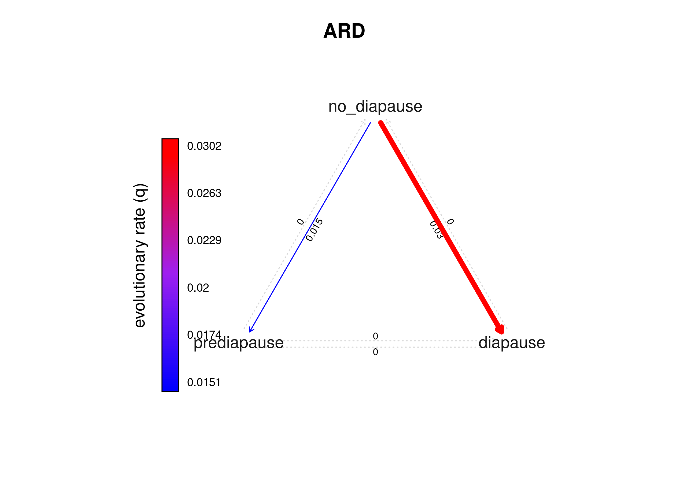
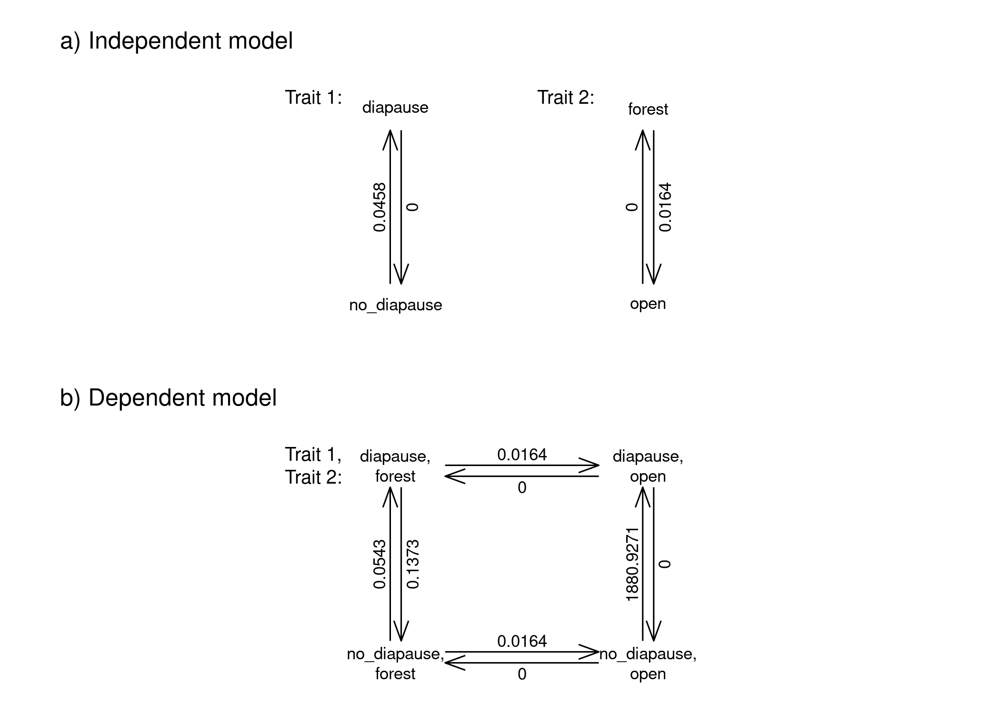

Modelling evolution of discrete traits
================
Sridhar Halali
2024-05-09

In this tutorial, we will apply some methods which can provide us
insights into the evolution of discrete traits. While, modelling the
evolution of continuous traits often uses Brownian motion model or its
variants (Brownian with trend, early burst, Ornstein-Uhlenbeck etc),
evolution of discrete traits is modeled using the Mk and extended Mk
models. We will carry out some basic analyses including fitting
different Mk models, quantifying number and transition rates, ancestral
state reconstructions and test for correlated evolution between two
discrete traits.

# Import required libraries & set working directory

``` r
library(ape)
library(phytools)
library(geiger)
library(ggplot2)
library(tidyverse)
library(openxlsx)

packageVersion("phytools") # make sure you have the latest version of phytools
```

    ## [1] '2.1.1'

``` r
# install from github if you don't have the recent phytools version
#remotes::install_github("liamrevell/phytools")
```

# Importing the phylogeny and data

The data comprises of habitat association and seasonal reproductive
strategies for 40 butterfly species from Africa. In the data file, the
‘habitat’ variable has three states- forest, fringe (species liked to
forest edges or clearings) and open (species found in savannahs) and
‘diapause_strategy’ has three states- no diapause (species reproduce
throughout the year), prediapause mating (mate but do not produce eggs)
and diapause (do not mate or produce eggs) in the dry season

Let’s have a look at the data first

``` r
butterfly_data <- read.xlsx("butterfly_data.xlsx")
head(butterfly_data, n=2)
```

    ##                        species habitat diapause_strategy
    ## 1      AM-97-V168_Bic_jefferyi  fringe       no_diapause
    ## 2 AM-97-V187_Bic_smithi_smithi  fringe       no_diapause

``` r
# look at the data structure (good to convert categories to factors)
glimpse(butterfly_data)
```

    ## Rows: 40
    ## Columns: 3
    ## $ species           <chr> "AM-97-V168_Bic_jefferyi", "AM-97-V187_Bic_smithi_sm…
    ## $ habitat           <chr> "fringe", "fringe", "fringe", "fringe", "fringe", "f…
    ## $ diapause_strategy <chr> "no_diapause", "no_diapause", "no_diapause", "predia…

``` r
# convert all columns into factors
butterfly_data <- butterfly_data %>% mutate_if(is.character, as.factor)

# Check number of states/levels for both habitat and diapause strategy variables
unique(butterfly_data$habitat)
```

    ## [1] fringe forest open  
    ## Levels: forest fringe open

``` r
unique(butterfly_data$diapause_strategy)
```

    ## [1] no_diapause prediapause diapause   
    ## Levels: diapause no_diapause prediapause

# Import, plot and prune the phylogeny

``` r
# Importing butterfly phylogeny
ButterflyTree <- read.nexus("butterfly_tree.trees")
ButterflyTree
```

    ## 
    ## Phylogenetic tree with 311 tips and 310 internal nodes.
    ## 
    ## Tip labels:
    ##   A-2-KA_Myc_francisca_formosana?, A-7-KA_Bic_cooksoni, AM-97-V165_Bic_brunnea, AM-97-V168_Bic_jefferyi, AM-97-V177_Bic_auricruda_fulgida, AM-97-V187_Bic_smithi_smithi, ...
    ## 
    ## Rooted; includes branch lengths.

``` r
# plotting
plotTree(ladderize(ButterflyTree), fsize=0.2, type="fan")
```

<!-- -->

``` r
# We have a lot of tips (311 tips) but only 40 species for which we have the trait data. To be able to proceed with the comparative analyses, we have the prune the phylogeny first so that the number of taxa in the data matches taxa in the phylogeny. Also, the tip names in the phylogeny should exactly match taxa names in the data. Lets start pruning using cool function 'name.check' in the geiger package....

# first, assign the first column as rownames
butterfly_data <- butterfly_data %>% column_to_rownames(var="species")
head(butterfly_data)
```

    ##                                  habitat diapause_strategy
    ## AM-97-V168_Bic_jefferyi           fringe       no_diapause
    ## AM-97-V187_Bic_smithi_smithi      fringe       no_diapause
    ## AM-98-A3_Bic_anisops              fringe       no_diapause
    ## AM-98-R065_Bic_madetes_madetes    fringe       prediapause
    ## AM-98-R092_Bic_campina_campina    fringe       no_diapause
    ## AM-98-R936_Bic_dorothea_dorothea  fringe       no_diapause

``` r
# using name.check function (tree should be provided first and then the dataframe)
TreeCheck <- name.check(ButterflyTree, butterfly_data)
length(TreeCheck$tree_not_data) # there are 271 taxa which are there in the tree but not in the data 
```

    ## [1] 271

``` r
# Prune the phylogeny
ButterflyTreePruned <- drop.tip(ButterflyTree, TreeCheck$tree_not_data)
ButterflyTreePruned
```

    ## 
    ## Phylogenetic tree with 40 tips and 39 internal nodes.
    ## 
    ## Tip labels:
    ##   A-7-KA_Bic_cooksoni, AM-97-V168_Bic_jefferyi, AM-97-V177_Bic_auricruda_fulgida, AM-97-V187_Bic_smithi_smithi, AM-97-V909_Bic_procora, AM-98-A3_Bic_anisops, ...
    ## 
    ## Rooted; includes branch lengths.

``` r
# ladderizing the phylogeny (just looks more pretty!)
ButterflyTreePruned <- ladderize(ButterflyTreePruned)

# plot
plotTree(ButterflyTreePruned, fsize=0.5, ftype="i", mar=c(2,1,1,1))
axisPhylo()
```

<!-- -->

``` r
# Sort rownames in the same order as tip labels
butterfly_data <- butterfly_data[ButterflyTreePruned$tip.label, ]
head(butterfly_data)
```

    ##                                  habitat diapause_strategy
    ## A-7-KA_Bic_cooksoni                 open          diapause
    ## AM-97-V168_Bic_jefferyi           fringe       no_diapause
    ## AM-97-V177_Bic_auricruda_fulgida  forest       no_diapause
    ## AM-97-V187_Bic_smithi_smithi      fringe       no_diapause
    ## AM-97-V909_Bic_procora            forest       no_diapause
    ## AM-98-A3_Bic_anisops              fringe       no_diapause

Let’s first plot both habitat and reproductive strategy data on the
phylogeny using ‘plotTree.datamatrix’ function from the phytools package

``` r
plot_tree <- plotTree.datamatrix(ButterflyTreePruned, butterfly_data, fsize=0.3, header=F, xexp=1.45, 
                    palettes=c("Oranges", "PuBuGn"))
```

    ## Loading required package: RColorBrewer

``` r
leg <- legend(x= 26, y=30, 
              names(plot_tree$colors$habitat), 
              cex=0.7, pch=22, 
              pt.bg= plot_tree$colors$habitat,
              pt.cex=1.5, title= "habitat")

leg <- legend(x= 26, y= 23,
              names(plot_tree$colors$diapause_strategy), 
              cex=0.7, pch=22, 
              pt.bg= plot_tree$colors$diapause_strategy,
              pt.cex=1.5, title= "diapause_strategy")
```

<!-- -->

# Starting with comparative analyses

## Fitting Mk models

Fitting (extended) Mk models and ancestral state reconstructions

One can fit Mk models or its variants by defining transition rates
between states. The simplest Mk model is for a binary trait (i.e. two
states let’s say a & b) where the rate of transition (q12) from a–\>b
and b–\>a is the same. This is the equal rates (ER) model. One can then
fit a slightly complex model where the rate of transition from a–\>b is
different from that of b–\>a. This is the all rates different (ARD)
model.

When the trait has \>2 states, we can fit more interesting and
hypothesis driven models. Apart from the equal rates (all transition
rates are equal) and all rates different (all transition rates are
different), we can fit a symmetric (SYM) model where transition rates
between adjacent states are set to equal. It is important to note that
the number of free parameters increase rapidly (= higher model
complexity) for SYM and ARD model. For SYM and ARD model, number of free
parameters equal to K(K-1)/2 and K(K-1), respectively, where K is number
of states for a given trait. Thus, a trait with three states, SYM and
ARD model will have 3 and 6 free parameters, respectively.

With this background, we’ll go ahead and fit some of these models for
the habitat and diapause data data

## First, extract ‘habitat’ and ‘diapause’ column and assign to the row names

``` r
habitat <- setNames(butterfly_data$habitat, rownames(butterfly_data))
levels(habitat)
```

    ## [1] "forest" "fringe" "open"

``` r
diapause <- setNames(butterfly_data$diapause_strategy, rownames(butterfly_data))
levels(diapause)
```

    ## [1] "diapause"    "no_diapause" "prediapause"

## Fit the equal rates, symmetric and all rates different models using ‘fitMk’ function from phytools

``` r
#======= fitting Mk model for habitat ========#
# equal rates model
habitat_ER <- fitMk(ButterflyTreePruned, habitat, model= "ER")

# symmetric model
habitat_SYM <- fitMk(ButterflyTreePruned, habitat, model= "SYM")

# all rates different model
habitat_ARD <- fitMk(ButterflyTreePruned, habitat, model= "ARD")

# check model fit
AIC(habitat_ER, habitat_SYM, habitat_ARD)
```

    ##             df      AIC
    ## habitat_ER   1 76.01583
    ## habitat_SYM  3 77.17136
    ## habitat_ARD  6 80.35520

``` r
anova(habitat_ER, habitat_SYM, habitat_ARD)
```

    ##                log(L) d.f.      AIC     weight
    ## habitat_ER  -37.00791    1 76.01583 0.59688553
    ## habitat_SYM -35.58568    3 77.17136 0.33494219
    ## habitat_ARD -34.17760    6 80.35520 0.06817228

``` r
# plotting rates
par(mfrow=c(1,3))
plot(habitat_ER, main= "ER")
plot.fitMk(habitat_SYM, main= "SYM")
plot(habitat_ARD, main= "ARD", width=T, color=T)
```

<!-- -->

## fitting Mk model for diapause

``` r
# equal rates model
diapause_ER <- fitMk(ButterflyTreePruned, diapause, model= "ER")

# symmetric model
diapause_SYM <- fitMk(ButterflyTreePruned, diapause, model= "SYM")

# all rates different model
diapause_ARD <- fitMk(ButterflyTreePruned, diapause, model= "ARD")

# check model fit
AIC(diapause_ER, diapause_SYM, diapause_ARD)
```

    ##              df      AIC
    ## diapause_ER   1 73.36038
    ## diapause_SYM  3 74.55137
    ## diapause_ARD  6 79.30517

``` r
anova(diapause_ER, diapause_SYM, diapause_ARD)
```

    ##                 log(L) d.f.      AIC     weight
    ## diapause_ER  -35.68019    1 73.36038 0.62403624
    ## diapause_SYM -34.27569    3 74.55137 0.34402511
    ## diapause_ARD -33.65258    6 79.30517 0.03193864

``` r
# Plotting rates
plot(diapause_ER, main= "ER")
```

<!-- -->

``` r
plot.fitMk(diapause_SYM, main= "SYM")
```

<!-- -->

``` r
plot(diapause_ARD, main= "ARD", width=T, color=T)
```

<!-- -->

# Fitting custom Mk models

Now let’s fit some more interesting custom models. First, let’s test the
hypothesis that direct transitions from forest to open habitat is not
possible or that habitat transitions occur in an ordered manner (this is
an ‘ordered model’). So we need to restrict forest–\>open transitions
and vice versa. We can do this by modifying the Q matrix. Second, let’s
fit an ‘ordered directional model’ where only forward transitions are
allowed (i.e. restrict fringe –\>forest, open–\>fringe transitions).

## Fit the Ordered model (restict open –\> forest transition)

``` r
# cheking the index matrix for the ARD model
habitat_ARD$index.matrix
```

    ##      [,1] [,2] [,3]
    ## [1,]   NA    3    5
    ## [2,]    1   NA    6
    ## [3,]    2    4   NA

``` r
levels(habitat)
```

    ## [1] "forest" "fringe" "open"

``` r
# modifying the index matrix
ordered_model <- matrix(c(
  0,1,0,
  2,0,3,
  0,4,0),
  ncol=3, nrow=3, byrow = T,
  dimnames = list(levels(habitat),
                  levels(habitat)))
ordered_model
```

    ##        forest fringe open
    ## forest      0      1    0
    ## fringe      2      0    3
    ## open        0      4    0

``` r
# now fit the ordered model
habitat_ordered <- fitMk(ButterflyTreePruned, habitat, model = ordered_model)
plot(habitat_ordered, main= "Ordered model")
```

<!-- -->

## Fit the ordered directional model

Restrict all the back transitions fringe –\>forest, open–\>fringe, and
forest\<–\>open)

``` r
directional_model <- matrix(c(
  0,1,0,
  0,0,2,
  0,0,0),
  ncol=3, nrow=3, byrow = T,
  dimnames = list(levels(habitat),
                  levels(habitat)))
directional_model
```

    ##        forest fringe open
    ## forest      0      1    0
    ## fringe      0      0    2
    ## open        0      0    0

``` r
habitat_directional <- fitMk(ButterflyTreePruned, habitat, model = directional_model)
plot(habitat_directional)
```

<!-- -->

## model fits

Now assess model fits using logLik and AIC score (notice the number of
free parameters for each model)

``` r
fitMK_model_fit <- data.frame(
  
  model= c("ER", "SYM", "ordered", "directional", "ARD"),
  
  logLik= c(habitat_ER$logLik, habitat_SYM$logLik, habitat_ordered$logLik, 
                                  habitat_directional$logLik, habitat_ARD$logLik),
                              
  AIC= c(AIC(habitat_ER, habitat_SYM, habitat_ordered, habitat_directional, habitat_ARD))
                                  )

fitMK_model_fit
```

    ##         model    logLik AIC.df  AIC.AIC
    ## 1          ER -37.00791      1 76.01583
    ## 2         SYM -35.58568      3 77.17136
    ## 3     ordered -34.17760      4 76.35520
    ## 4 directional -39.09624      2 82.19247
    ## 5         ARD -34.17760      6 80.35520

``` r
# Or using anova function
anova(habitat_ER, habitat_SYM, habitat_ordered, habitat_directional, habitat_ARD)
```

    ##                        log(L) d.f.      AIC     weight
    ## habitat_ER          -37.00791    1 76.01583 0.38988328
    ## habitat_SYM         -35.58568    3 77.17136 0.21878292
    ## habitat_ordered     -34.17760    4 76.35520 0.32903368
    ## habitat_directional -39.09624    2 82.19247 0.01777026
    ## habitat_ARD         -34.17760    6 80.35520 0.04452987

Equal rates model seems to be the better fitting model, at least
marginally, based on the AIC score. We’ll use this model further to
carry out ancestral reconstructions. Ancestral state reconstructions can
be done for both continuous and discrete traits. For continuous traits,
ancestral states can be estimated by assuming the trait is evolving via
Brownian motion model or its variants. For discrete traits, we can use
both maximum likelihood and Bayesian approach for reconstructing
ancestral states.

Here, we will use both maximum likelihood (function-‘ancr’) and
stochastic character mapping (function-‘make.simmap’) function from
phytools. Stochastic mapping is an Bayesian approach which simulates
diverse scenarios for our discrete character evolution on the tree (or
called stochastic maps). In this method, we can also allow changes to
happen along the branches and not just at the nodes which is the case
when maximum likelihood. Let’s a look at this method step by step. We’ll
use ‘make.simmap’ function from phytools to generate stochastic maps.
One can also use ‘corHMM’ and ‘diversitree’ R packages for stochastic
mapping.

## Maximum likelihood reconstruction

``` r
# set colors for habitat states (I'll use viridis R package to assign colors)
library(viridis)
```

    ## Loading required package: viridisLite

    ## 
    ## Attaching package: 'viridis'

    ## The following object is masked from 'package:maps':
    ## 
    ##     unemp

``` r
HabitatCols <- setNames(viridis(length(levels(habitat))), levels(habitat))

# Getting ancestral estimation 
habitat_anc_ML <- ancr(habitat_ER, tips=T)

# plotting
plot(habitat_anc_ML, 
     args.nodelabels=list(cex=0.7, piecol = HabitatCols),
     cex= 0.4,  ftype='off', mar=c(2,1,1,1))
axisPhylo()
```

<!-- -->

## Ancestral reconstruction using stochastic mapping

Let’s start by generating a single stochastic map using the equal rates
model

``` r
# generate single stochastic map
simmap_ER_single <- make.simmap(ButterflyTreePruned, habitat, model= "ER")
```

    ## make.simmap is sampling character histories conditioned on
    ## the transition matrix
    ## 
    ## Q =
    ##             forest      fringe        open
    ## forest -0.05805184  0.02902592  0.02902592
    ## fringe  0.02902592 -0.05805184  0.02902592
    ## open    0.02902592  0.02902592 -0.05805184
    ## (estimated using likelihood);
    ## and (mean) root node prior probabilities
    ## pi =
    ##    forest    fringe      open 
    ## 0.3333333 0.3333333 0.3333333

    ## Done.

``` r
# plot single stochastic map
plot(simmap_ER_single, lwd=2, fsize=0.4, color=HabitatCols)
legend("bottomleft",c("forest","fringe", "open"),
  pch=21,pt.bg=HabitatCols,pt.cex=2)
```

<!-- -->

This one stochastic map in itself doesn’t tell us much - we need to look
at the whole distribution from a sample of stochastic maps. Let’s
simulate 100 such stochastic maps

``` r
simmap_ER_100 <- make.simmap(ButterflyTreePruned, habitat, model= "ER", nsim=100)
```

    ## make.simmap is sampling character histories conditioned on
    ## the transition matrix
    ## 
    ## Q =
    ##             forest      fringe        open
    ## forest -0.05805184  0.02902592  0.02902592
    ## fringe  0.02902592 -0.05805184  0.02902592
    ## open    0.02902592  0.02902592 -0.05805184
    ## (estimated using likelihood);
    ## and (mean) root node prior probabilities
    ## pi =
    ##    forest    fringe      open 
    ## 0.3333333 0.3333333 0.3333333

``` r
# have a look at these 100 stochastic maps. Can you notice the variation across these trees?
# par(mfrow=c(10,10))
# sapply(simmap_ER_100, plotSimmap, lwd=1, ftype="off")

# Interpreting these 100 stochastic maps is extremely difficult. One useful thing that can be done is to summarize patterns across these trees and phytools function 'summary'. Give a close look to the output. 
summary_ER_100 <- summary(simmap_ER_100)
summary_ER_100
```

    ## 100 trees with a mapped discrete character with states:
    ##  forest, fringe, open 
    ## 
    ## trees have 22.48 changes between states on average
    ## 
    ## changes are of the following types:
    ##      forest,fringe forest,open fringe,forest fringe,open open,forest
    ## x->y          3.93         2.7          6.61        4.62        2.42
    ##      open,fringe
    ## x->y         2.2
    ## 
    ## mean total time spent in each state is:
    ##           forest      fringe       open    total
    ## raw  135.5266063 163.9701171 76.4207155 375.9174
    ## prop   0.3605223   0.4361865  0.2032912   1.0000

## Plot reconstructed states

``` r
par(mfrow= c(1,1))

plot(summary_ER_100, colors=HabitatCols, fsize=0.5, ftype='i', mar=c(2,1,1,1))
axisPhylo()

legend("bottomleft",c("forest","fringe", "open"),
  pch=21,pt.bg=HabitatCols,pt.cex=2)
```

<!-- -->

## Doing some downstream analyses

We can do lot of other interesting downstream analyses using stochastic
maps For example, we can compute a posterior probability distribution on
the number of changes of each type (see here:
<http://blog.phytools.org/2022/07/understanding-number-of-changes-of.html>)

``` r
dd <- density(simmap_ER_100)

# a bit of a clunky plot but you get the point!
par(mar=c(4,4,4,4))
plot(dd)
```

<!-- -->

Some things to be cognizant of when fitting Mk models and doing
ancestral reconstructions: keep an eye on model complexity or number of
free parameters that needs to be estimated, size of phylogeny (is the
phylogeny big enough to fit complex models, are particularity long or
short branches missing), which root prior to use (phytools uses flat
prior by default, you can try using the fitzjohn prior), tip bias (are
some states too less frequent?)

# Testing for correlated evolution between discrete binary traits

We’ll test a hypotheses of whether species which occur in open habitats
tend to undergo diapause more frequency. That is, evolution of diapause
occurs in a habitat-dependent manner. The way to test for correlated
evolution is by first fitting an ‘independent model’ where two traits
evolve independently and a ‘dependent model’ where both traits evolve in
correlated fashion. We can then look at the log likelihood scores for
both model to see whether independent or dependent model fits better.
We’ll use a maximum likelihood approach here using fitPgael() function
from phytools to test for correlated evolution. It is also possible to
carry out this analyses in a Bayesian framework in the popular program
BayesTraits (see here:
<http://www.evolution.reading.ac.uk/BayesTraitsV4.0.1/BayesTraitsV4.0.1.html>)

One pre-requisite to run this analyses is that the traits should be
binary. So let’s first convert our habitat and mating strategy data into
binary states

``` r
# Binarising habitats
butterfly_data_binary <- butterfly_data %>% 
  mutate(
    
    habitat_binary= case_when(
    habitat == "forest" ~ "forest",
    habitat == "fringe" ~ "forest",
    habitat == "open" ~ "open"), 
  
  strategy_binary= case_when(
    diapause_strategy == "no_diapause" ~ "no_diapause",
    diapause_strategy == "prediapause" ~ "diapause",
    diapause_strategy == "diapause" ~ "diapause")) %>% 
  
  select(habitat_binary, strategy_binary)

# check if merging has happenend properly. There should now be two states for each variable 
unique(butterfly_data_binary$habitat_binary)
```

    ## [1] "open"   "forest"

``` r
unique(butterfly_data_binary$strategy_binary)
```

    ## [1] "diapause"    "no_diapause"

``` r
# factorise 
butterfly_data_binary$habitat_binary <- as.factor(butterfly_data_binary$habitat_binary)
butterfly_data_binary$strategy_binary <- as.factor(butterfly_data_binary$strategy_binary)

#Extract extract habitat_binary and strategy_binary column and assign them to row names
habitat_binary <- setNames(butterfly_data_binary$habitat_binary, rownames(butterfly_data_binary))
strategy_binary <- setNames(butterfly_data_binary$strategy_binary, rownames(butterfly_data_binary))
```

Plot both binary habitat and mating strategy data onto a phylogeny (you
can also use plotTree.datamatrix function here)

``` r
dev.off()
```

    ## null device 
    ##           1

``` r
plot_tree <- plotTree.datamatrix(ButterflyTreePruned, butterfly_data_binary, fsize=0.3, header=F, xexp=1.45, 
                    palettes=c("Oranges", "PuBuGn"))

leg <- legend(x= 26, y=30, names(plot_tree$colors$habitat_binary), cex=0.7, pch=22, pt.bg= plot_tree$colors$habitat_binary,
              pt.cex=1.5, title= "habitat")

leg <- legend(x= 26, y= 23,
              names(plot_tree$colors$strategy_binary), cex=0.7, pch=22, pt.bg= plot_tree$colors$strategy_binary,
              pt.cex=1.5, title= "diapause_strategy")
```

# Fitting model of correlated evolution

Proceed to fit our model and print the result. fitPagel() fits both
independent and dependent model and compares the likelihood of both
models

``` r
# We will fit the model where mating strategy (x) depends on habitat (y)
CorrEvo_model <- fitPagel(ButterflyTreePruned, x=strategy_binary, y=habitat_binary,
                             dep.var="x", pi="fitzjohn")

print(CorrEvo_model)
```

    ## 
    ## Pagel's binary character correlation test:
    ## 
    ## Assumes "ARD" substitution model for both characters
    ## 
    ## Independent model rate matrix:
    ##                    diapause|forest diapause|open no_diapause|forest
    ## diapause|forest          -0.016416      0.016416           0.000000
    ## diapause|open             0.000000      0.000000           0.000000
    ## no_diapause|forest        0.045766      0.000000          -0.062182
    ## no_diapause|open          0.000000      0.045766           0.000000
    ##                    no_diapause|open
    ## diapause|forest            0.000000
    ## diapause|open              0.000000
    ## no_diapause|forest         0.016416
    ## no_diapause|open          -0.045766
    ## 
    ## Dependent (x only) model rate matrix:
    ##                    diapause|forest diapause|open no_diapause|forest
    ## diapause|forest          -0.153713      0.016416           0.137297
    ## diapause|open             0.000000      0.000000           0.000000
    ## no_diapause|forest        0.054320      0.000000          -0.070736
    ## no_diapause|open          0.000000   1880.927134           0.000000
    ##                    no_diapause|open
    ## diapause|forest            0.000000
    ## diapause|open              0.000000
    ## no_diapause|forest         0.016416
    ## no_diapause|open       -1880.927134
    ## 
    ## Model fit:
    ##             log-likelihood      AIC
    ## independent      -40.54363 89.08726
    ## dependent        -33.30110 78.60219
    ## 
    ## Hypothesis test result:
    ##   likelihood-ratio:  14.4851 
    ##   p-value:  0.000715498 
    ## 
    ## Model fitting method used was fitMk

``` r
plot(CorrEvo_model, signif=4, cex.main=1, cex.sub=0.8, cex.traits=0.7, cex.rates=0.7, lwd=1)
```

<!-- -->

The likelihood scores indicate that the dependent model has a much
better fit than the independent model. We, thus, can say that
reproductive strategies in these butterflies evolve in a
habitat-dependent manner. What are transition rates telling us?

However, when testing for correlated evolution, once should be careful
about the patterns in which the traits have evolved. For example, what
if both traits have evolved only once or are an unique evolutionary
event, will there still be an evidence for correlated evolution? For
other similar scenarios, see Figure 1 in this important paper by
FitzJohn & Maddison (2015): The Unsolved Challenge to Phylogenetic
Correlation Tests for Categorical Characters
(<https://academic.oup.com/sysbio/article/64/1/127/2847997>)

Let’s try and test how this model handles unique evolutionary events
(codes are borrowed from Revell & Harmon (2022) phylogenetic comparative
methods book:
<https://press.princeton.edu/books/paperback/9780691219035/phylogenetic-comparative-methods-in-r>)

``` r
# set seed to make the example reproducible
set.seed(6)

# simulate 26 taxon tree with labels
par(mfrow=c(1,1))
tree <- pbtree(n=26, tip.label=LETTERS)
plotTree(tree)
```

<!-- -->

``` r
## generate three different data patterns in this tree
x <- as.factor(setNames(c("a", "a", c(rep("b", 12), rep("a", 12))), LETTERS))
y <- as.factor(setNames(c("c", "c", c(rep("d", 12), rep("c", 12))), LETTERS))
z <- as.factor(setNames(c("e", "e", rep(c("f", "e"), 6), rep("e", 12)), LETTERS))

## visualize the data using phytools function plotTree.datamatrix() 
plotTree.datamatrix(tree, data.frame(x,y,z), 
                              fsize=1, space=0.2, xexp=1.4,
                              palettes= c("OrRd","PuOr","RdYlBu"))
```

<!-- -->

``` r
# Now lets fit the fitPagel() function

# testing for correlation between x & y
fit.xy <- fitPagel(tree, x, y)
print(fit.xy)
```

    ## 
    ## Pagel's binary character correlation test:
    ## 
    ## Assumes "ARD" substitution model for both characters
    ## 
    ## Independent model rate matrix:
    ##           a|c       a|d       b|c      b|d
    ## a|c -0.171804  0.085902  0.085902 0.000000
    ## a|d  0.000000 -0.085902  0.000000 0.085902
    ## b|c  0.000000  0.000000 -0.085902 0.085902
    ## b|d  0.000000  0.000000  0.000000 0.000000
    ## 
    ## Dependent (x & y) model rate matrix:
    ##          a|c       a|d       b|c      b|d
    ## a|c 0.000000  0.000000  0.000000 0.000000
    ## a|d 2.374014 -3.039727  0.000000 0.665713
    ## b|c 2.374014  0.000000 -3.039727 0.665713
    ## b|d 0.000000  0.000000  0.000000 0.000000
    ## 
    ## Model fit:
    ##             log-likelihood      AIC
    ## independent      -10.88077 29.76154
    ## dependent         -4.91937 25.83874
    ## 
    ## Hypothesis test result:
    ##   likelihood-ratio:  11.9228 
    ##   p-value:  0.0179347 
    ## 
    ## Model fitting method used was fitMk

``` r
plot(fit.xy, signif=2, cex.main=1.5, cex.sub=1, cex.traits=0.7, lwd=1)
```

<!-- -->

We find an evidence for correlated evolution! Test for correlated
evolution between x and z

``` r
fit.xz <- fitPagel(tree, x, z)
print(fit.xz)
```

    ## 
    ## Pagel's binary character correlation test:
    ## 
    ## Assumes "ARD" substitution model for both characters
    ## 
    ## Independent model rate matrix:
    ##           a|e        a|f       b|e        b|f
    ## a|e -9.347729   9.261827  0.085902   0.000000
    ## a|f 30.233348 -30.319250  0.000000   0.085902
    ## b|e  0.000000   0.000000 -9.261827   9.261827
    ## b|f  0.000000   0.000000 30.233348 -30.233348
    ## 
    ## Dependent (x & y) model rate matrix:
    ##           a|e       a|f         b|e         b|f
    ## a|e -0.053975  0.000000    0.053975    0.000000
    ## a|f  2.730565 -3.270201    0.000000    0.539636
    ## b|e  0.000000  0.000000 -176.611355  176.611355
    ## b|f  0.000000  0.000000  176.611355 -176.611355
    ## 
    ## Model fit:
    ##             log-likelihood      AIC
    ## independent      -19.41250 46.82500
    ## dependent        -13.64762 43.29523
    ## 
    ## Hypothesis test result:
    ##   likelihood-ratio:  11.5298 
    ##   p-value:  0.0212131 
    ## 
    ## Model fitting method used was fitMk

``` r
plot(fit.xz, signif=2, cex.main=1.5, cex.sub=1, cex.traits=0.7, lwd=1)
```

<!-- -->

Once again we find an evidence for correlated evolution!

A new model has been recently developed to counter such one-off events.
Check it out here: Boyko & Beaulieu (2023):Reducing the Biases in False
Correlations Between Discrete Characters.
<https://academic.oup.com/sysbio/article/72/2/476/6730956?login=true>

Finally, if you’re interested in learning more about the theory behind
phylogenetic comparative methods/models, check out this book by Luke
Harmon which is freely available. Harmon (2019)- Phylogenetic
comparative methods: learning from trees (see here:
<https://lukejharmon.github.io/pcm/>)
